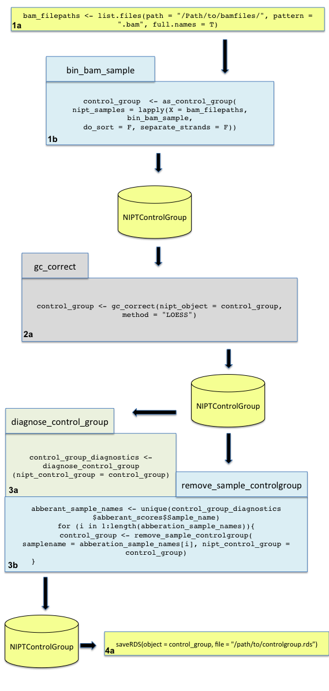
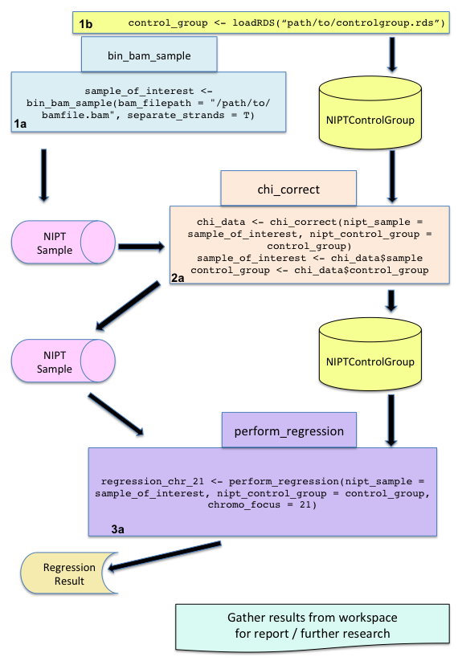
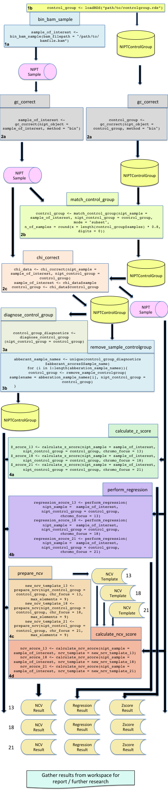

```{r, echo = FALSE}
knitr::opts_chunk$set(
  eval = FALSE
  
)
```
---
title: "NIPTeR: fast and accurate trisomy prediction in non-invasive prenatal testing"
author: "Lennart F. Johansson & Hendrik A. de Weerd"
date: "`r Sys.Date()`"
output: rmarkdown::html_vignette
vignette: >
  %\VignetteIndexEntry{Vignette Title}
  %\VignetteEngine{knitr::rmarkdown}
  \usepackage[utf8]{inputenc}
---

```{r, eval = TRUE, echo = FALSE}
example_bin_counts <- structure(c(308, 243, 0, 624, 448, 0, 247, 163, 303, 263, 189, 
637, 249, 174, 266, 216, 270, 262, 287, 257, 274, 213, 234, 244, 
157, 269, 245, 240, 262, 142, 217, 209, 148, 225, 264, 229, 239, 
231, 142, 243, 99, 225, 251, 241, 205, 324, 88, 255, 146, 285, 
258, 251, 241, 355, 264, 259, 236, 259, 242, 216, 244, 383, 230, 
261), .Dim = c(8L, 8L), .Dimnames = list(c(" 1", "2", "3", "4", 
"5", "6", "7", "8"), c("1", "2", "3", "4", "5", "6", "7", "8"
)))
```

```{r, eval = TRUE, echo = FALSE}
example_regression_stats <- structure(c("-0.171248675025602", "0.00615122686158584", "Practical_CV", 
"0.583158688871931", "11  2  5  12", "1.00050469190991", "0.00335713985926308", 
"-0.799303637284865", "0.00599131304613039", "Practical_CV", 
"0.503865450973465", "10  19  17  16", "1.00011356353248", "0.00394053718934269"
), .Dim = c(7L, 2L), .Dimnames = list(c("Z_score_sample", "CV", 
"cv_types", "P_value_shapiro", "Predictor_chromosomes", "Mean_test_set", 
"CV_train_set"), c("Prediction_set_1", "Prediction_set_2")))
```

```{r, eval = TRUE, echo = FALSE}
example_bin_counts_sex <- structure(c(0, 0, 160, 0, 6, 0, 266, 0, 127, 0, 85, 0, 182, 0, 
235, 0), .Dim = c(2L, 8L), .Dimnames = list(c("X", "Y"), c("1", 
"2", "3", "4", "5", "6", "7", "8")))
```

```{r, eval = TRUE, echo = FALSE}
example_match_report <- structure(c(6.76557504762928e-07, 2.15862500903867e-06, 3.10100948006486e-06, 
3.29198583437393e-06, 3.58809416090935e-06, 3.83885934221371e-06, 
4.43239735020721e-06, 7.8916102881966e-06, 9.73718696931918e-06, 
1.12605046722957e-05), .Dim = c(10L, 1L), .Dimnames = list(c("Sample 6", 
"Sample 8", "Sample 1", "Sample 10", "Sample 9", "Sample 3", "Sample 5", 
"Sample 2", "Sample 7", "Sample 4"), "Sum_of_squares"))
```
# NIPTeR package
This vignette is an explanation on how to use NIPTeR. It starts with a short introduction, the second chapter explains the two most important objects in this package, `NIPTSample` and `NIPTControlgroup`. The third chapter explains all the analysis functions, the arguments the function take and their output. The last chapter shows some workflow examples.

## Introduction

Non-Invasive Prenatal Testing (NIPT) is a method based on analysis of cell-free fetal (cff) DNA in maternal blood using next-generation sequencing. The basic approach is relatively straightforward: cell-free DNA is isolated from the mothers blood plasma and the obtained DNA fragments are sequenced. Subsequently the number of DNA fragments originating from the different chromosomes is counted, since in case of a fetal trisomy a relative increase of the fraction of reads of the trisomic chromosome is expected.
	Various analysis methods for trisomy prediction, variation reduction and quality control have been described in the literature. These methods can be combined to improve the sensitivity of the analysis. The NIPTeR package makes these methods available and allows for flexibility in workflow design. 
NIPTeR uses BAM files as input and calculates chromosomal fractions, which are used for trisomy prediction. These fractions are based on read counts of the different chromosomes. The chromosomes are divided in bins to allow for read count correction.


##Package
The atomic unit of analysis in this package is a `NIPTSample` object 

A `NIPTSample` object is a named list of length 5, having the following fields:

1. `autosomal_chromosome_reads` A list containing the bin count matrices for the autosomal chromosomes. If forward and reverse reads are counted separately the list contains two matrices, if the reads are counted together it contains one. In these matrices the columns represent bins and the 22 rows represent the chromosomes. For a small excerpt of such a matrix see Table 1.

1. `correction_status_autosomal_chromosomes` Correction status of the autosomal chromosomes. Default is _Uncorrected_

1. `sex_chromosome_reads` List containing bin count matrices for the sex chromosomes. If forward and reverse reads are counted separately the list contains two matrices, if the reads are counted together it contains one. In these matrices the columns represent bins and the two represent rows the chromosomes. For a small excerpt of such a matrix see Table 2.

1. `correction_status_sex_chromosome` Correction status of the sex chromosomes. Default is _Uncorrected_

1. `sample_name` The name of the sample. Default is the filename of the .bam it originates from with the path prefix and .bam suffix
<br><br>
```{r, eval=TRUE, echo = FALSE, results = "asis"}
pander::pandoc.table(example_bin_counts, caption = "Table 1: Example data bin counts. The rows represent chromosomes and the columns bins", include.rownames = T)
```
<br><br>
```{r, eval=TRUE, echo = FALSE, results = "asis"}
pander::pandoc.table(example_bin_counts_sex, caption = "Table 2: Example data bin counts sex chromosomes. The rows represent chromosomes and the columns bins", include.rownames = T)
```

The panel of control samples to which the sample of interest can be compared is also modelled in an object, `NIPTControlGroup`. A control group is a named list and composed of `NIPTSample` objects. It has the following fields:

1. `samples` The `NIPTSample` objects

1. `correction_status_autosomal_chromosomes` Correction status of the  autosomal chromosomes of the samples. Default is _Uncorrected_

1. `correction_status_sex_chromosomes` Correction status of the sex chromosomes of the samples. Default is _Uncorrected_

1. `Description` Description of the control group. This can either be _Generic control group_ or _Fitted to sample name_


## Functions

### Loading BAM files

To load a bam file, use the `bin_bam_sample` function. The bam file does not need to be sorted, but its recommended to use pre-sorted bam files 
```{r}
bin_bam_sample(bam_filepath, do_sort = F, separate_strands = F, custom_name = NULL)
```

The arguments `bin_bam_sample` takes:

1. `bam_filepath` The location and filename on the file system where the bam file is stored.

1. `do_sort`  Sort the bam file? If the bam is unsorted set to true, but the use of pre-sorted bam files is recommended.

1. `separate_strands` If set to true, reads from forward and reverse strands are counted and stored separately. This option should be used if you are planning on using regression, since this doubles the number of predictors (F+R) and distributes predictive power more equally over prediction sets since F and R strand from the same chromosome cannot be both in one prediction set. 

1. `custom_name` The sample name. Default samplename is the filename of the bam file without the .bam suffix and filepath prefix. 

## Variation reduction functions

### GC correction
GC content bias is the correlation between the number of reads mapped to a specific genomic region and the GC content of this region. In NIPTeR, two GC bias correction algorithms have been implemented, the LOESS based method introduced by Chen et al. (2011) and the bin weight based method described by Fan and Quake (2010).  

```{r}
gc_correct(nipt_object, method, include_XY = F, span = 0.75)
```
 
1. `nipt_object` The object that will be corrected. This can either be a `NIPTSample` or a `NIPTControlGroup` object.

1. `method` To select the LOESS based method use  "_LOESS_",  to select the bin weights based method use  "_bin_". 

1. `include_XY` Also perform correction on the X and Y chromosomes?

1. `span` The span for the LOESS fit. Only applicable when LOESS method is used. 

1. `ref_genome` The reference genome used. Either "_hg37_" or "_hg38_" default = "_hg37_"


The output of the gc_correct function is a similar object as the input; when the input is a `NIPTSample` the output will also be a (corrected)
`NIPTSample`, and the same applies for a `NIPTControlGroup` object. . After correction the correction status of the object is set to _GC_corrected_.

Code snippit:
```{r}
#Correct NIPTSample object using LOESS method
loess_corrected_sample <- gc_correct(nipt_object = sample_of_interest, method = "LOESS",
                                     include_XY = F, span = 0.75)
#Correct NIPTControlGroup object using bin method
gc_bin_corrected_control_group <- gc_correct(nipt_object = control_group, method = "bin", 
                                             include_XY = T)

```

### Match control group
The `matchcontrolgroup` function determines how well an `NIPTSample` fits within the `NIPTControlGroup` and, if needed, makes a subset `NIPTControlGroup` of length _n_.
```{r}
matchcontrolgroup(nipt_sample, nipt_control_group, mode, n_of_samples,
  include_chromosomes = NULL, exclude_chromosomes = NULL)
```
Explanation of the arguments `matchcontrolgroup` takes:

1. `nipt_sample` The `NIPTSample` object that is the focus of the analysis.

1. `nipt_control_group` The `NIPTControlGroup` object used in the analysis.

1. `mode` The function mode. This can either be "_subset_" or "_report_". Mode "_subset_" means the return value will be a new `NIPTControlGroup` object containing  _n_ samples. When mode "_report_" is used the output is a matrix containing the sum of squares score of the differences between the chromosomal fractions of the sample and the control for every control sample, sorted in increasing score.

1. `n_of_samples` The length of the resulting NIPTControlGroup. Only applicable if mode "_subset_" is used.

1. `include_chromosomes` Include potential trisomic chromosomes into the comparison? Default = NULL, meaning chromosomes 13, 18 and 21 are not included.

1. `exclude_chromosomes` Exclude other autosomal chromosomes besides chromosomes 13, 18 and 21? Default = NULL.

The output for mode _subset_ is a new `NIPTControlGroup` composed of _n_ samples. 
The output for mode _report_ is a matrix with a single column containing the sum of squares
in ascending order.

```{r, eval=TRUE, echo = FALSE, results = "asis"}
pander::pandoc.table(example_match_report , caption = "Table 3: Example match_control_group mode 'subset'", include.rownames = T)
```

Code snippit:
```{r}
#Run matchcontrolgroup in mode "report"
scores_control_group <- matchcontrolgroup(nipt_sample = gc_LOESS_corrected_sample, 
                                          nipt_control_group = gc_LOESS_corrected_control_group, 
                                          mode = "report", include_chromosomes = c(13,18))
#Run matchcontrolgroup in mode "subset" and select 50 best matching samples
subset_loess_corrected_control_group <- matchcontrolgroup(nipt_sample = gc_LOESS_corrected_sample, 
                                                          nipt_control_group = loess_corrected_control_group, 
                                                          mode = "subset", n_of_samples = 50)

```

### Chi-squared based variation reduction
The chi-squared based variation reduction identifies overdispersed bins within the control group and corrects these bins in both the sample of interest and the control group. The function takes in a `NIPTSample` and a `NIPTControlGroup` object, both to be corrected. For every corresponding bin in the control group a chi-squared score is calculated and this total score is converted to a normal distribution. Corresponding bins with a normalized score above _chi_cutoff_ (default 3.5) are corrected by dividing the number of reads by the total chi-squared score divided by degrees of freedom

```{r}
chi_correct(nipt_sample, nipt_control_group, chi_cutoff = 3.5, include_XY = F)
```

1. `nipt_sample` The `NIPTSample` object that is the focus of the analysis.

1. `nipt_control_group` The `NIPTControlGroup` object used in the analysis.

1. `chi_cutoff` The normalized cut-off threshold.

1. `include_XY` Also perform correction on the X and Y chromosomes?

The output of this function is a named list containing two fields, the first field
is the corrected sample (`$sample`) and the second the corrected control group (`$control_group`). 

Code snippit:
```{r}
#Apply chi-squared based variation reduction method
chi_corrected_data <- chicorrect(nipt_sample = gc_LOESS_corrected_sample, 
                                 nipt_control_group = subset_loess_corrected_control_group)
#Extract sample and control group
loess_chi_corrected_sample <- chi_corrected_data$sample
subset_loess_chi_corrected_control_group <- chi_corrected_data$control_group
```

## Trisomy prediction functions

### Z-score

In the Z-score approach, introduced by Chiu et al in 2008, the chromosomal fraction of interest of a sample is compared to the chromosomal fractions of interest of the reference samples, the `NIPTControlGroup` object. 

```{r}
calculate_z_score(nipt_sample, nipt_control_group, chromo_focus)
```
<br>
This function takes three arguments:

1. `nipt_sample` The `NIPTSample` object that is the focus of the analysis.

1. `nipt_control_group`  The `NIPTControlGroup` object used in the analysis.

1. `chromo_focus` The chromosome of interest. Most commonly chromosome 13, 18 or 21. However, every autosomal chromosome can be predicted.

<br>

The output of the function is an object of class `ZscoreResult`. It is a named list containing seven fields:

1. `sample_Zscore` A numeric, The Z score for the sample of interest for the sample of interest.

1. `control_group_statistics` Named num of length 3, the first field being the mean (name mean), the second field is the standard deviation (name SD) and the third field is the P value of the Shapiro-Wilk test (name Shapiro_P_value).

1. `control_group_Zscores` Matrix containing the Z scores of the chromosome of interest for all used control samples.

1. `focus_chromosome` The chromosome of interest. Most commonly chromosome 13, 18 or 21. However, every autosomal chromosome can be predicted.

1. `control_group_sample_names` The sample names of all control group samples used in the analysis.

1. `correction_status` The correction status of the control group.

1. `sample_name` The sample_name of the sample of interest.

Code snippit:
```{r}
#Calculate Z score for chromosome 13
z_score_result_13 <- calculate_z_score(nipt_sample = loess_chi_corrected_sample, 
                                       nipt_control_group = subset_loess_chi_corrected_control_group,
                                       chromo_focus = 13)
```

### Regression based Z-score

The regression based Z-score builds _n_ models with _m_ predictors using stepwise regression with forward selection. The models are used to predict the chromosomal fraction of interest, for the sample and for the control group. The observed fractions are then divided by the expected fraction, and Z-scores are calculated over these ratios. The Z-score is calculated by subtracting one from the ratio of the sample and dividing this result by the coefficient of variation. The coefficient of variation (CV) can either be the _Practical_ or _Theoretical_ CV. The Theoretical CV is the standard error multiplied by the overdispersion. Theoretically, the CV cannot be lower than the standard error of the mean. If it is case the CV is lower than Theoretical CV, then the Theoretical CV is used.  

```{r}
perform_regression(nipt_sample, nipt_control_group, chromo_focus,
  n_models = 4, n_predictors = 4, exclude_chromosomes = NULL,
  include_chromosomes = NULL, use_test_train_set = T,
  size_of_train_set = 0.6, overdispersion_rate = 1.15,
  force_practical_vc = F)
```

1. `nipt_sample` The `NIPTSample` object that is the focus of the analysis.

1. `nipt_control_group` The `NIPTControlGroup` object used in the analysis.

1. `chromo_focus` The chromosome of interest. Most commonly chromosome 13, 18 or 21. However, every autosomal chromosome can be predicted.

1. `n_models` Number of linear models to be made. Default setting is 4 models.

1. `n_predictors` The number of predictors each model contains. Default is 4.

1. `exclude_chromosomes` Exclude which autosomal chromosomes as potential predictors? Default potential trisomic chromosomes 13, 18 and 21 are exluded. 

1. `include_chromosomes` Include potential trisomic chromosomes? Options are: chromosomes 13, 18 and 21.

1. `use_test_train_set` Use a test and train set to build the models? Default is TRUE.

1. `size_of_train_set` The size of the train set expressed in a decimal. Default is 0.6 (60% of the control samples).

1. `overdispersion_rate` The standard error of the mean is multiplied by this factor. 

1. `force_practical_vc` Ignore the theoretical CV and always use the practical CV.

The output of this function is an object of type `RegressionResult`, a named list containing: 

1. `prediction_statistics` A dataframe with 7 rows and a column for every model. Table 3 is an example of such a dataframe.

```{r, eval=TRUE, echo = FALSE, results = "asis"}
pander::pandoc.table(example_regression_stats, caption = "Table 2: Example regression results and statistics", include.rownames = T)
```


1. `control_group_Zscores` A matrix containing the regression based Z-scores for the control sample

1. `focus_chromosome` The chromosome of interest. Most commonly chromosome 13, 18 or 21. However, every autosomal chromosome can be predicted.

1. `correction_status` The correction status of the control group autosomes.

1. `control_group_sample_names` The sample names of the test set group.

1. `models` List of the summary.lm() output for every model.

1. `potential_predictors` The total pool of chromosomes where the predictors are selected from.

1. `all_control_group_Z_scores` Z-scores for every sample using theoretical and practical VCs.

1. `additional_statistics` Statistics for both the practical and theoretical CVs for every prediction set.


### Normalized Chromosome Value
<br>
The Normalized Chromosome Value or NCV (Sehnert et al., 2011) method selects a subset of chromosomes to calculate the chromosomal fractions. The 'best' subset is the set which yields the lowest coefficient of variation for the chromosomal fractions of the chromosome of interest in the control group. Because a brute force approach is used to determine the best subset, which can be computationally intensive,this method is divided into two functions, `prepare_ncv` and `calculate_ncv`. `prepare_ncv` returns a template object (NCVTemplate) for a given chromosome of interest and the control group used. This template can be used for any number of analyses. If the control group or chromosome of interest changes, a new template must be made. <br>
`calculate_ncv` uses a NCVTemplate and a NIPTSample to calculate the NCV score for the NIPTSample.

#### prepare_ncv

```{r}
prepare_ncv(nipt_control_group, chr_focus, max_elements,
  exclude_chromosomes = NULL, include_chromosomes = NULL,
  use_test_train_set = T, size_of_train_set = 0.6)
```

1. `nipt_control_group` The `NIPTControlGroup` object used in the analysis.

1. `chr_focus` The chromosome of interest. Most commonly chromosome 13, 18 or 21. However, every autosomal chromosome can be predicted.

1. `max_elements` The maximum number of denominator chromosomes. 

1. `exclude_chromosomes` Exclude which autosomal chromosomes as potential predictors? Default potential trisomic chromosomes 13, 18 and 21 are exluded. 

1. `include_chromosomes` Include potential trisomic chromosomes? Options are: chromosomes 13, 18 and 21.

1. `use_test_train_set` Use a test and train set to to build the models? Default is TRUE.

1. `size_of_train_set` The size of the train set expressed in a decimal. Default is 0.6 (60% of the control group samples).

The output of this function is an object of class NCVTemplate, a named list.

1. `denominators` The set of 'best' denominators.

1. `focus_chromosome` The chromosome of interest used for this `NCVTemplate` object.

1. `control_group_sample_names` The sample names of the test set samples.

1. `correction_status` The correction status of the `NIPTControlGroup` used.

1. `control_group_Zscores` The NCV scores for the test set samples.

1. `potential_denominators` The total pool of denominators the best denominators are selected from.

1. `control_group_statistics`  Named num of length 3, the first field being the mean (name mean), the second field is the standard deviation (name SD) and the third field is the P value of the Shapiro-Wilk test (name Shapiro_P_value).

1. `sample_names_train_set` The names of the samples used in the train set.

1. `train_set_statistics` Named num of length 3, the first field being the mean of the train set (name mean), the second field is the standard deviation of the train set (name SD) and the third field is the P value of the Shapiro-Wilk test of the train set (name Shapiro_P_value).

1. `train_set_Zscores`  Matrix containing the Z scores for the train set samples.

<br>

#### calculate_ncv

```{r}
calculate_ncv_score(nipt_sample, ncv_template)
```

1. `nipt_sample` The `NIPTSample` object that is the focus of the analysis.

1. `ncv_template` An object of class NCVTemplate that is produced by function `prepare_ncv`


The output of this function is an object of class NCVResult, which is basically the same as a NCVTemplate object,
the only difference being the NCV score of the sample appended to the list.

##Control group functions

#### as_control_group
This functions converts a list of `NIPTSample` objects to a `NIPTControlGroup` object and return this object.
```{r}
as_control_group(nipt_samples)
```

1 `nipt_samples` A list of `NIPTSample` objects. 

This functions adds `NIPTSample` objects to an existing control group and returns a new `NIPTControlGroup` object.
<br><br>

#### add_samples_controlgroup

```{r}
add_samples_controlgroup(nipt_control_group, samples_to_add)
```

1. `nipt_control_group` The `NIPTControlGroup` to add the samples to.

1. `samples_to_add` A list with sample(s) to add. This always needs to be a list.


<br>

#### remove_duplicates_controlgroup

This functions removes duplicate samples from the control group based on name. It returns a new `NIPTControlGroup` object.

```{r}
remove_duplicates_controlgroup(nipt_control_group)
```

1. `nipt_control_group` The `NIPTControlGroup` object to remove duplicates from.
<br><br>

#### remove_sample_controlgroup
This function removes a sample from the `NIPTControlGroup` object by name. Note that this function uses a regular expression, and if more sample_names satisfy the regular expression, they will also be removed. It returns a new `NIPTControlGroup` object. 
<br><br>
```{r}
remove_sample_controlgroup(samplename, nipt_control_group)
```

1. `samplename` samplename Regular expression string. All matching samplenames 
are removed from the control group.

1. `nipt_control_group` `NIPTControlGroup` object where the samples are removed from.
<br>

#### diagnose_control_group

This function computes a regular Z-score for every chromosome of every sample in the `NIPTControlGroup` object. It returns a named list with diagnostics information.
<br><br>
```{r}
diagnose_control_group(nipt_control_group)
```

1. `nipt_control_group` The `NIPTControlGroup` to diagnose.

<br>

The function returns a named list with 3 fields:

1. `Z_scores` A matrix containing Z-scores for every sample and every chromosome.

1. `abberant_scores` Dataframe with samplename and chromosome of Z-scores outside -3  3 range. 

1. `control_group_statistics` Matrix with mean, standard deviation and P value of Shapiro-Wilk test.
<br>

#Examples

<br>

##Preparation

<br>

### Control group
Since NIPT is based on the comparison of the sample of interest to a set of samples with no known aneuploidies, the first thing that should be done before any samples can be analyzed is making this `NIPTControlGroup`. A `NIPTControlGroup` is an object and is composed of `NIPTSample` objects. 
First, all bam file paths have to be collected in a vector. This tutorial assumes all .bam files are in the same directory. To collect all bam files the following command can be used:

`bam_filepaths <- list.files(path = "/Path/to/bamfiles/", pattern = ".bam", full.names = T)`

Subsequently, the filepaths must be fed to the function `bin_bam_sample`. This function loads bam files and converts them to `NIPTSample` objects. For example:      

```{r}

list_NIPT_samples <- lapply(X = bam_filepaths, bin_bam_sample, do_sort = FALSE, 
                             separate_strands = T, custom_name = NULL)

```
     

In this example we count the forward and reverse reads separately and a pre-sorted bam file is used, so the argument do_sort is ommited since the default is F. 


Using the above command all samples will be loaded with the same default settings. To load the files with for instance custom names, store the filenames in a vector of the same length as the bam filepath vector and use `mapply`. For example:        
      
          
`list_NIPT_samples <- mapply(FUN = bin_bam_sample, bam_filepaths, name = names, SIMPLIFY = F)`
     

To convert the list of `NIPTSamples` to a `NIPTControlGroup` object use:

`control_group <- as_control_group(nipt_samples = list_NIPT_samples)`

of course, the fastest and simplest way is to wrap the `as_control_group` function around the loading of samples like this: <br><br>
```{r}
control_group  <- as_control_group(nipt_samples = lapply(X = bam_filepaths, bin_bam_sample, 
                                                         do_sort = F, separate_strands = T))
```
   
<br> or when applying custom names: <br><br>

```{r}
control_group  <- as_control_group(nipt_samples = mapply(FUN = bin_bam_sample, bam_filepaths, 
                                                         custom_name = names, SIMPLIFY = FALSE))
```

<br> To store the control group on disk for later use:

`saveRDS(object = control_group, file = "/Path/to/directory/control_group.rds")`

So, in conclusion, the data control group preparation script might look something like this: 
<br>
```{r}
library(NIPTeR)
#Retrieve filenames
bam_filepaths <- list.files(path = "/Path/to/bamfiles/", pattern = ".bam", full.names = T)
#Load files and convert to control group
control_group  <- as_control_group(nipt_samples = lapply(X = bam_filepaths, bin_bam_sample, 
                                                         do_sort = F, separate_strands = FALSE))
#Save control group for later
saveRDS(object = control_group, file = "/Path/to/directory/control_group.rds")
```

Assuming a `NIPTControlGroup` object has been prepared and stored on disk we can analyse our first sample. The script starts with loading the `NIPTeR` package:

`library(NIPTeR)`

After that, we can load a sample of interest with the `bin_bam_sample` function:

`sample_of_interest <- bin_bam_sample(bam_filepath = "/path/to/sample.bam",  separate_strands = T)`

<br>
<p>

<figcaption> A possible workflow to create a control group is shown in figure 1. In this example first a list of samples to include in the control group is created (1a) and bin counts are created for each of those samples (1b). Secondly, all samples in the control group are LOESS gc corrected (2a). Thirdly, the resulting control group is checked for samples having aberrant scores (3a) and if present, those samples are removed (3b). The resulting control group is than saved.
</figcaption>
</p>

```{r}
library(NIPTeR)
#Gather all bam filepaths in a vector. Corresponds to 1a in figure
bam_filepaths <- list.files(path = "/Path/to/bamfiles/", pattern = ".bam", full.names = T)
#Load all bam files using lapply and feed the results to function as_control_group,
#converting the NIPTSamples to a NIPTControlGroup object. Corresponds to 1b in figure
control_group  <- as_control_group(nipt_samples = lapply(X = bam_filepaths, bin_bam_sample,
                                                         do_sort = F, separate_strands = F))
#apply a gc LOESS correction to all samples. Since this can take up to 30 seconds
#sample, doing this once for a control group and store the results can be rewarding
#in terms of analysis time. Corresponds to 2a in figure
gc_control_group <- gc_correct(nipt_object = control_group, method = "LOESS")
#Retrieve control group diagnostics. Corresponds with 3a in figure
control_group_diagnostics <- diagnose_control_group(nipt_control_group = control_group)
#Retrieve samplenames with an abberant Z score for any chromosome and remove these samples 
#from the control group. Corresponds with 3b in figure
abberant_sample_names <- unique(control_group_diagnostics$abberant_scores$Sample_name)
for (i in 1:length(abberant_sample_names)){
  control_group <- remove_sample_controlgroup(samplename = abberant_sample_names[i], 
                                              nipt_control_group = control_group)
}
#Save the gc_corrected control groups to disk. Corresponds to 4a in figure
saveRDS(object = control_group, file = "/path/to/controlgroup.rds")
```


<br>
<p>

<figcaption>  An example of a simple workflow, including a chi-squared based variation reduction and a trisomy prediction using the regression-based Z-score is shown in figure 2. Firstly, bin counts are made for the analysed sample (1a) and a relevant control group is loaded (1b). Secondly, using the control group, both the analysed sample and the control samples are chi_corrected (2a). Thirdly, the corrected control group is used to create a regression model for a trisomy 21 prediction of the NIPT sample (3a). Results can be gathered from the workspace.
</figcaption>
</p>
```{r}
library(NIPTeR)
#Load sample. Corresponds with 1a in figure
sample_of_interest <- bin_bam_sample(bam_filepath = "/Path/to/bamfile.bam", separate_strands = T)
#Load control group. Corresponds with 1b in figure
control_group <- readRDS("/Path/to/control_group.rds")
#Perform a chi-square based variation reduction on new trimmed control group and sample and
#extract data. Corresponds with 2a in figure
chi_data <- chi_correct(nipt_sample = sample_of_interest, nipt_control_group = control_group)
sample_of_interest <- chi_data$sample
control_group <- chi_data$control_group
#Perform regression for chromosome 21 with default settings, so:
#Create 4 models with 4 predictors each
#All chromosomes are potential predictors except the potential trisomic chromosomes 13, 18 and 21
#Use a test and train set where the size of the train set is 60% of the control group
#Assume at least 15% overdispersion in the data
#Dont force practical CV, so if the CV is below 1.15 * standard error of the mean use this as VC
#Corresponds with 3a in figure
regression_score_21 <- perform_regression(nipt_sample = sample_of_interest, 
                                          nipt_control_group = control_group, chromo_focus = 21)


###       Gather relevant data from the objects on the workspace     #######
```
<br>

<br>
<p>

<figcaption>An example of a simple workflow, including a GC correction, selection of a control group fitted to the sample, a chi-squared based variation reduction, automatic control group managing and trisomy prediction using the Z-score, NCV and the regression-based Z-score is shown in figure 3. Firstly, bin counts are made for the analysed sample (1a) and a relevant control group is loaded (1b).
Secondly, variability is reduced  by LOESS gc correcting the sample of interest and all samples in the control group (2a), followed by a selection of the 80% of control samples that best match the control sample for further analysis of the sample of interest (2b).  Using the control group, both the analysed sample and the control samples are than chi_corrected (2c). 
Thirdly, the resulting control group is checked for samples having aberrant scores (3a) and if present, those samples are removed (3b).
Fourthly, a Z-score is calculated for chromosomes 13, 18 and 21 (4a), as well as a regression-based Z-score (4b). Furthermore, the best denominators for NCV calculation of chromosomes 13, 18 and 21 are determined (4c) and the NCV is calculated for those chromosomes (4d).
Results can be gathered from the workspace.

</figcaption>
</p>
```{r}
library(NIPTeR)
#Load sample. Corresponds with 1a in figure
sample_of_interest <- bin_bam_sample(bam_filepath = "/Path/to/bamfile.bam")
#Load control group. Corresponds with 1b in figure
control_group <- readRDS("/Path/to/control_group.rds")
#Peform a GC correction type bin for the sample and the controlgroup
#Corresponds with 2a in figure
sample_of_interest <- gc_correct(nipt_object = sample_of_interest, method = "bin")
control_group <- gc_correct(nipt_object = control_group, method = "bin")
#Trim control group by only selecting 80% of best matching control samples
#Corresponds with 2b in figure
control_group <- match_control_group(nipt_sample = sample_of_interest, nipt_control_group = control_group, 
                                     mode = "subset", n_of_samples = round(length(control_group$samples) *.8, 
                                                                           digits = 0))
#Perform a chi-square based variation reduction on new trimmed control group and sample and
#extract data. Corresponds with 2c in figure
chi_data <- chi_correct(nipt_sample = sample_of_interest, nipt_control_group = control_group)
sample_of_interest <- chi_data$sample
control_group <- chi_data$control_group
#Retrieve control group diagnostics. Corresponds with 3a in figure
control_group_diagnostics <- diagnose_control_group(nipt_control_group = control_group)
#Retrieve samplenames with an abberant Z score for any chromosome and remove these samples 
#from the control group. Corresponds with 3b in figure
abberant_sample_names <- unique(control_group_diagnostics$abberant_scores$Sample_name)
for (i in 1:length(abberant_sample_names)){
  control_group <- remove_sample_controlgroup(samplename = abberant_sample_names[i], 
                                              nipt_control_group = control_group)
}
#Calculate Z score from chromosomes 13, 18 and 21. Corresponds with 4a in figure 
z_score_13 <- calculate_z_score(nipt_sample = sample_of_interest, 
                                nipt_control_group = control_group, chromo_focus = 13)
z_score_18 <- calculate_z_score(nipt_sample = sample_of_interest, 
                                nipt_control_group = control_group, chromo_focus = 18)
z_score_21 <- calculate_z_score(nipt_sample = sample_of_interest, 
                                nipt_control_group = control_group, chromo_focus = 21)
#Perform regression for all potential trisomic chromosomes with default settings, so:
#Create 4 models for every potential trisomic chromosome with 4 predictors each
#All chromosomes are potential predictors except the potential trisomic chromosomes 13, 18 and 21
#Use a test and train set where the size of the train set is 60% of the control group
#Assume at least 15% overdispersion in the data
#Dont force practical CV, so if the CV is below 1.15 * standard error of the mean use this as VC
#Corresponds with 4c in figure
regression_score_13 <- perform_regression(nipt_sample = sample_of_interest, 
                                          nipt_control_group = control_group, chromo_focus = 13)
regression_score_18 <- perform_regression(nipt_sample = sample_of_interest, 
                                          nipt_control_group = control_group, chromo_focus = 18)
regression_score_21 <- perform_regression(nipt_sample = sample_of_interest, 
                                          nipt_control_group = control_group, chromo_focus = 21)
#Get NCVTemplates for all potential trisomic chromosomes with max 9 denominators and default settings, so:
#All autosomals chromosomes are potential predictors, except the potential trisomic chromosomes 13, 18 and 21
#Use a test and train set where the size of the train set is 60% of the control group
#Corresponds with 4c in figure
new_ncv_template_13 <- prepare_ncv(nipt_control_group = control_group, chr_focus = 13, max_elements = 9)
new_ncv_template_18 <- prepare_ncv(nipt_control_group = control_group, chr_focus = 18, max_elements = 9)
new_ncv_template_21 <- prepare_ncv(nipt_control_group = control_group, chr_focus = 21, max_elements = 9)
#Use the NCVTemplates to get NCV scores for the sample of interest
#Corresponds with 4d in figure
ncv_score_13 <- calculate_ncv_score(nipt_sample = sample_of_interest, ncv_template = new_ncv_template_13)
ncv_score_18 <- calculate_ncv_score(nipt_sample = sample_of_interest, ncv_template = new_ncv_template_18)
ncv_score_21 <- calculate_ncv_score(nipt_sample = sample_of_interest, ncv_template = new_ncv_template_21)


###       Gather relevant data from the objects on the workspace     #######


```
<br>
